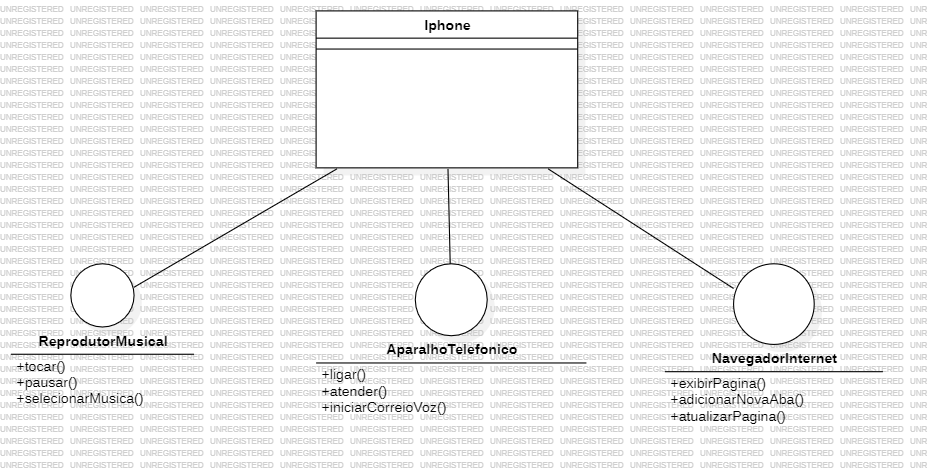

# Projeto iPhone - Desafio de Código DIO

Este projeto foi desenvolvido como parte de um desafio de código da Digital Innovation One (DIO). O objetivo foi criar um modelo de um iPhone com suas principais funcionalidades: Reprodutor Musical, Aparelho Telefônico e Navegador na Internet, utilizando conceitos de Programação Orientada a Objetos (POO) em Java.

## 📋 Funcionalidades

O projeto simula as funcionalidades básicas de um iPhone, implementadas através de interfaces e uma classe concreta que as agrupa:

### Reprodutor Musical

- `tocar()`: Inicia a reprodução de uma música.
- `pausar()`: Pausa a música que está tocando.
- `selecionarMusica(String nomeMusica)`: Seleciona uma música pelo nome.

### Aparelho Telefônico

- `ligar(String numero)`: Faz uma chamada para o número especificado.
- `atender()`: Atende uma chamada.
- `iniciarCorreioVoz()`: Inicia o correio de voz.

### Navegador na Internet

- `exibirPagina(String url)`: Exibe uma página da web a partir da URL fornecida.
- `adicionarNovaAba()`: Adiciona uma nova aba no navegador.
- `atualizarPagina()`: Atualiza a página atual do navegador.

## 🛠️ Estrutura do Projeto

O projeto é composto pelas seguintes partes:

- **Interfaces**:

  - `AparelhoTelefonico`: Define os métodos para as funcionalidades de telefone.
  - `NavegadorNaInternet`: Define os métodos para as funcionalidades de navegação na internet.
  - `ReprodutorMusical`: Define os métodos para as funcionalidades de reprodução musical.

- **Classe `Iphone`**:

  - Implementa as três interfaces (`AparelhoTelefonico`, `NavegadorNaInternet`, `ReprodutorMusical`), simulando as funcionalidades de um iPhone.

- **Classe `Main`**:
  - Classe principal que instancia a classe `Iphone` e executa as funcionalidades para fins de teste.

## 📊 Diagrama UML

Abaixo está o diagrama UML que representa a modelagem do iPhone:

# Considerações finais

Este projeto foi uma excelente oportunidade para aplicar conceitos de POO e entender como modelar sistemas mais complexos. A implementação foi simples, mas pode ser estendida para incluir mais funcionalidades e refinamentos.
